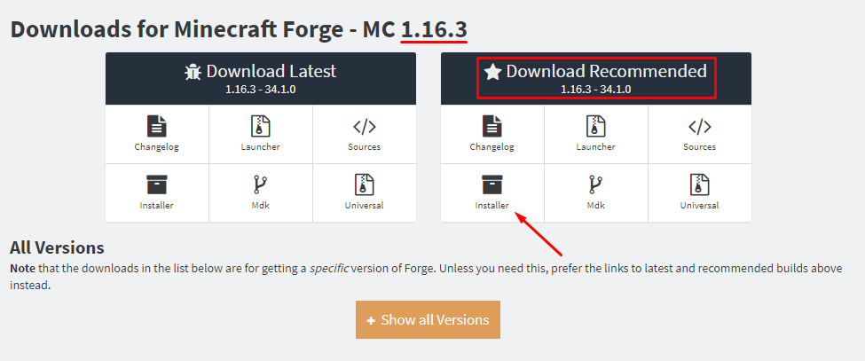

[Portuguese Version](./README_PT.md)

-------------------------------------------

  
  
  
  

This is a Very Random Mod!

📦 How to install
==============================
1. Download the [forge installer for Minecraft `1.16.3`](http://files.minecraftforge.net/maven/net/minecraftforge/forge/index_1.16.3.html)   

  

2. Open the installer and click `Ok` (check that you have **Java** installed!)  

3. Start the **Forge** instance on your launcher and when Minecraft opens close it  

4. [Download the mod](https://www.curseforge.com/minecraft/mc-mods/very-random-mod/files) and place it in the `%appdata%/.minecraft/mods`

-------------------------------------------
### 👨🏻‍💻 Made with 🧡 by Romilo
[Youtube](https://www.youtube.com/channel/UCHqIF6pyzrlCHy8sPFmTLzg)
 
[Instagram](https://instagram.com/romilo903)
 
[Twitter](https://twitter.com/romilo903)
 
[GitHub](https://github.com/romilodev)
