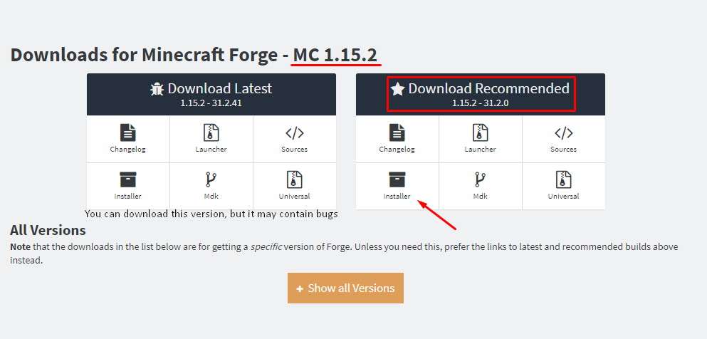
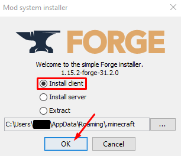
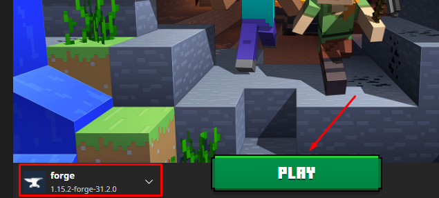

[English Version](./README.md)

-------------------------------------------

  
  
  
  

Este é um Mod Muito Aleatório!

📦 Instalação
==============================
1. Faça o download do [instalador do forge para o Minecraft `1.15.2`](http://files.minecraftforge.net/maven/net/minecraftforge/forge/index_1.15.2.html)   

  

2. Abara o instalador transferido e clique em `Ok` (verifique que tem o **Java** instalado!)  

3. Inicie a instância **Forge** no seu launcher e quando o Minecraft abrir feche-o  

4. [Faça o download do Mod](https://www.curseforge.com/minecraft/mc-mods/very-random-mod/files) e coloque-o na pasta `%appdata%/.minecraft/mods`

-------------------------------------------
### 👨🏻‍💻 Feito com 🧡 por Romilo
[Youtube](https://www.youtube.com/channel/UCHqIF6pyzrlCHy8sPFmTLzg)
 
[Instagram](https://instagram.com/romilo903)
 
[Twitter](https://twitter.com/romilo903)
 
[GitHub](https://github.com/romilodev)
